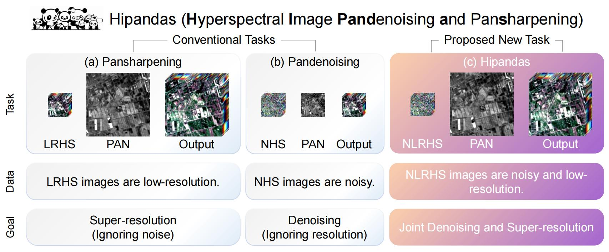

# 🐼 Hipandas: Hyperspectral Image Joint Denoising and Super-Resolution Framework 

Codes for **"Hipandas: Hyperspectral Image Joint Denoising and Super-Resolution by Image Fusion with the Panchromatic Image" (ICCV 2025)**

[Shuang Xu(徐爽)](https://teacher.nwpu.edu.cn/shuangxu), [Zixiang Zhao(赵子祥)](https://zhaozixiang1228.github.io/), Haowen Bai(白浩闻), Chang Yu(余畅), [Jiangjun Peng(彭江军)](https://teacher.nwpu.edu.cn/pengjj), [Xiangyong Cao(曹相湧)](https://gr.xjtu.edu.cn/web/caoxiangyong), [Deyu Meng(孟德宇)](https://gr.xjtu.edu.cn/en/web/dymeng)
       
         
                  
<p align="center">

<br>
<em>Hipandas: a novel learning paradigm that reconstructs high quality HSIs from noisy low-resolution HSIs (NLRHS) and high-resolution PAN images</em>
</p>

## 📌 Overview
This project implements the UHipandas method proposed in the paper 
"Hipandas: Hyperspectral Image Joint Denoising and Super-Resolution by Image Fusion with the Panchromatic Image" (ICCV 2025). 
Traditional hyperspectral image processing treats denoising and super-resolution as separate sequential tasks, 
leading to accumulated errors and suboptimal results. Hipandas introduces a novel joint framework that simultaneously 
addresses both challenges by fusing noisy low-resolution hyperspectral images (NLRHS) with high-resolution panchromatic 
(PAN) images, achieving superior spatial resolution and spectral fidelity.

## 🧠 Methodology

### Core Innovation
Hipandas revolutionizes hyperspectral image restoration through a **unified optimization paradigm** that replaces traditional 
sequential processing with simultaneous denoising and super-resolution. This approach leverages the complementary strengths of:
- Noisy low-resolution hyperspectral images (rich spectral information)
- High-resolution panchromatic images (detailed spatial information)

By integrating these modalities in a joint framework, Hipandas overcomes the limitations of step-by-step processing pipelines 
that propagate errors between stages .

### Key Technical Contributions

1. **Two-Stage Training Strategy**
   <p align="center">
   
   <br>
   <em>The two-stage training strategy of UHipandas</em>
   </p>
   
   - **Stage 1 (Pretraining)**: Individual networks are pretrained to establish strong initial parameters
   - **Stage 2 (Joint Training)**: Networks are optimized together with cross-network constraints to ensure consistency

2. **Dual Low-Rank Priors**
   - **HSI Low-Rank Prior**: Captures global spectral correlations to preserve spectral integrity 
   - **Detail-Oriented Low-Rank Prior**: Enhances local spatial details from PAN images

### Network Architecture

The framework comprises three interconnected components working in synergy:

1. **GDN (Guided Denoising Network)**
   - Utilizes low-rank matrix decomposition combined with deep learning
   - Learns spectral-spatial correlations to suppress noise while preserving critical features
   - Incorporates gated recurrent convolution units for effective spatio-spectral feature extraction 
   - Takes noisy LRHS as input and produces clean low-resolution HSIs

2. **GSRN (Guided Super-Resolution Network)**
   - Enhances spatial resolution using both denoised HSIs and PAN image guidance
   - Implements multi-scale feature fusion to propagate fine details from PAN to HSI
   - Uses low-rank decomposition to maintain spectral consistency during upsampling 

3. **PRN (Panchromatic Reconstruction Network)**
   - Predicts PAN images from super-resolved HSIs to enforce cross-modal consistency
   - Implements cross-layer guided attention mechanisms for effective feature alignment 
   - Serves as a spectral-spatial consistency check to prevent distortion

### Working Principle
1. GDN first removes noise from input NLRHS using spectral low-rank properties
2. GSRN upsamples the denoised HSI while integrating spatial details from PAN
3. PRN reconstructs PAN from the super-resolved HSI, creating a feedback loop that:
   - Ensures spatial details from PAN are appropriately transferred
   - Preserves spectral characteristics of the original HSI
   - Minimizes spectral distortion common in traditional fusion methods 

## 🛠️ Requirements
- Python 
- PyTorch 
- Kornia 
- NumPy
- SciPy
- Matplotlib
- scikit-image


## 📁 Project Structure
```
Hipandas/
├── model.py              # Network architectures (GDN, GSRN, PRN) 
├── simulate_data.py      # Generate noisy hyperspectral datasets with various noise models   
├── main.py               # Main training & evaluation pipeline (orchestrates model training/inference)   
├── eval_metric.py        # Calculate quantitative metrics (PSNR, SSIM, SAM, ERGAS)   
├── utils/                # Core utility modules  
│   ├── common.py         # Basic utilities (seed setup, device config, data conversion)  
│   ├── metrics.py        # Core metric calculation functions (used by eval_metric.py)  
│   ├── rsshow.py         # Visualization tools for hyperspectral/panchromatic images  
│   ├── spectral_tools.py # Spectral processing utilities (e.g., spectral response handling)  
│   └── noise_model.py    # Noise generation implementations (Gaussian, impulse, mixed noise) 
├── data/                 # Dataset storage (to be created; populated by simulate_data.py)  
└── result/               # Output directory for reconstructed images & metrics (auto-created)
```

## 📥 Dataset Preparation
1. Create a `data` directory in the project root
2. Download the base data `Dongying_1_1.mat`
       Link: https://pan.baidu.com/s/15hdJooFUbSzGbbz1gMdAyQ?pwd=nwpu
       Password: nwpu 
4. Place `Dongying_1_1.mat` into the `data` directory:
   ```
   data/
   └── Dongying_1_1.mat          
   ```
5. Run the data simulation script to generate various noise cases:
   ```bash
   python simulate_data.py
   ```
6. The script will create organized subdirectories with simulated noise:
   ```
   data/
   ├── g10/           # Gaussian noise (σ=10)
   │   ├── Dongying_0_0.mat
   │   ├── Dongying_0_1.mat
   │   └── ... (81 images total)
   ├── g30/           # Gaussian noise (σ=30)
   ├── gni/           # Gaussian + impulse noise
   ├── mix15/         # Mixed noise 1
   ├── mix35/         # Mixed noise 2
   └── mix55/         # Mixed noise 3
   ```
7. Each MAT file contains:
   - `I_GT`: Ground truth hyperspectral image 
   - `I_LRHS`: Low-resolution hyperspectral image 
   - `I_PAN`: Panchromatic image 
   - `N_LRHS`: Noisy low-resolution hyperspectral image 

## 🚀 Running the Code

### Basic Execution
Process all noise cases with default parameters:
```bash
python main.py
```

### Key Parameters (configurable in main.py)
- `noise_case`: List of noise scenarios to process (`['g10', 'g30', 'gni', 'mix15', 'mix35', 'mix55']`)
- `lr`: Learning rate (default: 1e-3)
- `num_epoch`: Training epochs for pretraining and main training (default: [400, 600])
- `rank`: Rank parameter for low-rank decomposition modules

### Result Output 
Results are saved in the following directory structure:
```
result/
└── UHipandas/
    ├── g10/
    │   ├── Dongying_0_0.mat
    │   └── ...
    ├── g30/
    └── ...
```
Output includes:
- Reconstructed high-resolution hyperspectral images
- Evaluation metrics printed to console (PSNR, SSIM, SAM, ERGAS)
- Runtime statistics for each processing stage

## 📊 Evaluation
Run the evaluation script to generate comprehensive performance metrics:
```bash
python eval_metric.py
```
This produces an Excel file with quantitative results:
- PSNR (Peak Signal-to-Noise Ratio) - measures reconstruction fidelity
- SSIM (Structural Similarity Index) - assesses structural preservation
- ERGAS (Error Relative Global Accuracy in Synthesis) - evaluates spectral-spatial quality
- SAM (Spectral Angle Mapper) - quantifies spectral distortion

## 🔍 Performance Highlights

<p align="center">

<br>
<em>Results with Gaussian noise</em>
</p>
<p align="center">

<br>
<em>Results with mixed noise</em>
</p>
   
## 📚 Citation
If you use this code in your research, please cite our paper:
```
@inproceedings{UHipandas,
  author       = {Shuang Xu and 
                  Zixiang Zhao and 
                  Haowen Bai and 
                  Chang Yu and 
                  Jiangjun Peng and 
                  Xiangyong Cao and 
                  Deyu Meng},
  title        = {Hipandas: Hyperspectral Image Joint Denoising and Super-Resolution by Image Fusion with the Panchromatic Image},
  booktitle    = {International Conference on Computer Vision (ICCV)},
  pages        = {},
  year         = {2025},
}
```

## 📄 License
This project is licensed under the MIT License - see the LICENSE file for details.

---

⭐ If you find this project useful, please give it a star! Your support motivates us to improve further.
